# Project Paris - Todo Application

Software Engineering - Selected Topics in Software Engineering (Cloud Computing 1) 
Heilbronn University 
Marcel Frey (202200)

## Project Overview

#### Course / Project Objective

- Build a cloud application and host it at a cloud provider
- Create a containerized Backend-Service which provides a REST-API and uses a Cloud Database Service
- Develop a Static Website that calls the Backend REST-API and host it in a Cloud Storage Service
- The application should run locally with Docker-Compose
- Advanced: Automate the deployment

#### Results

- [x] **Single Page Application Frontend** built with Nuxt.js, Vue.js, Bootstrap and TypeScript
- [x] **Containerized Backend-Service** built with Nest.js and TypeScript
- [x] **Keycloak** used for authentication and authorization
- [x] Runs entirely local with **Docker** and **Docker-Compose**
- [x] Runs entirely in the cloud on **Amazon Web Services (AWS)**: S3, CloudFront, VPC, EC2, ECS, ECR, RDS, DynamoDB, IAM, Secrets Manager
- [x] The AWS Infrastructure is **100%** declared with **Terraform**
- [x] The Application can be continuously deployed via a **CI/CD Pipeline**
- [x] **Documentation** for building and running the App yourself
- [x] Documented learnings, problems, challenges, improvements and alternative solutions

## Documentation and Setup

This README gives an overview of the project and shows the results. 
For a detailed documentation, check out the other README files:

- [Idea for the Project and Requirements](documentation/01.Idea/README.md)
- [DynamoDB Table Modelling](documentation/02.DynamoDB-Modelling/README.md)
- [Frontend-Application](todo-frontend/README.md)
- [Backend-Service](todo-service/README.md)
- [Keycloak](keycloak/README.md)
- [Infrastructure as Code - Terraform](terraform/README.md)
- [Setup: Local Setup](documentation/03.Local-Setup/README.md)
- [Setup: AWS Setup](documentation/04.AWS-Setup/README.md)
- [Intermediate Presentation](documentation/05.Intermediate-Presentation/README.md)
- [Final Presentation](documentation/06.Final-Presentation/README.md)
- [Learnings](documentation/07.Learnings-and-Possible-Improvements/LEARNINGS.md)
- [Possible Improvements](documentation/07.Learnings-and-Possible-Improvements/IMPROVEMENTS.md)
- Code Comments, sometimes with background infos, problems I had, and solutions for these problems

## Architecture and Services

#### AWS Architecture

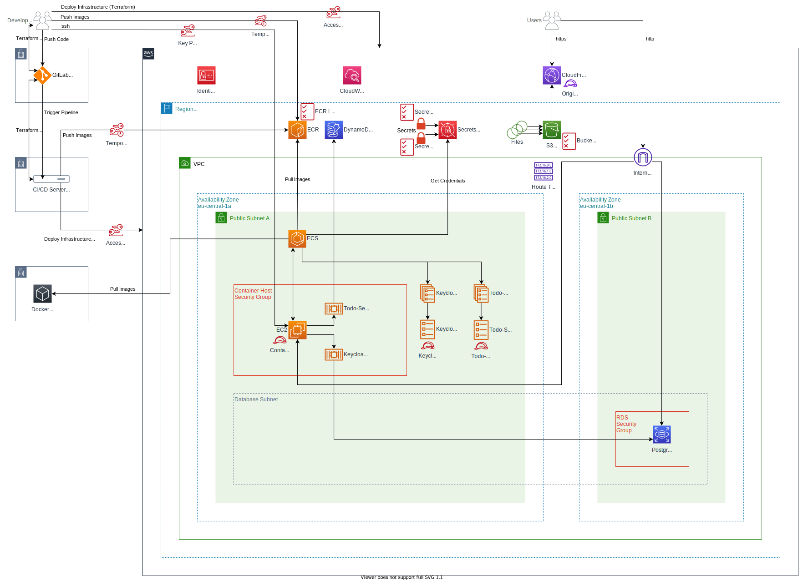

#### AWS Services

| AWS Service                          | Description                                                                                                                       |
|--------------------------------------|-----------------------------------------------------------------------------------------------------------------------------------|
| Simple Storage Service (S3)          | Host the static assets                                                                                                            |
| CloudFront                           | Distribute the static website                                                                                                     |
| Virtual Private Cloud (VPC)          | Networking for EC2 and RDS                                                                                                        |
| Elastic Compute Cloud (EC2)          | An EC2 Instance which is used as Container Host for the Elastic Container Service                                                 |
| Elastic Container Service (ECS)      | Run and manage containers                                                                                                         |
| Elastic Container Registry (ECR)     | A fully managed container registry where the Docker Images of the Backend-Service are stored                                      |
| Relational Database Service (RDS)    | A fully maned PostgreSQL Database which is used by Keycloak                                                                       |
| DynamoDB                             | Fully managed NoSQL Database where the Backend-Service stored Todo-Lists and Todos                                                |
| Secrets Manager                      | Securely store passwords and secrets. ECS takes Secret-ARNs as environment variables so that secrets are not stored in plain text |
| Identity and Access Management (IAM) | For User-Groups, Users, Roles and Policies                                                                                        |

#### AWS Terraform State Graph

The Terraform State of the AWS Architecture as Graph:

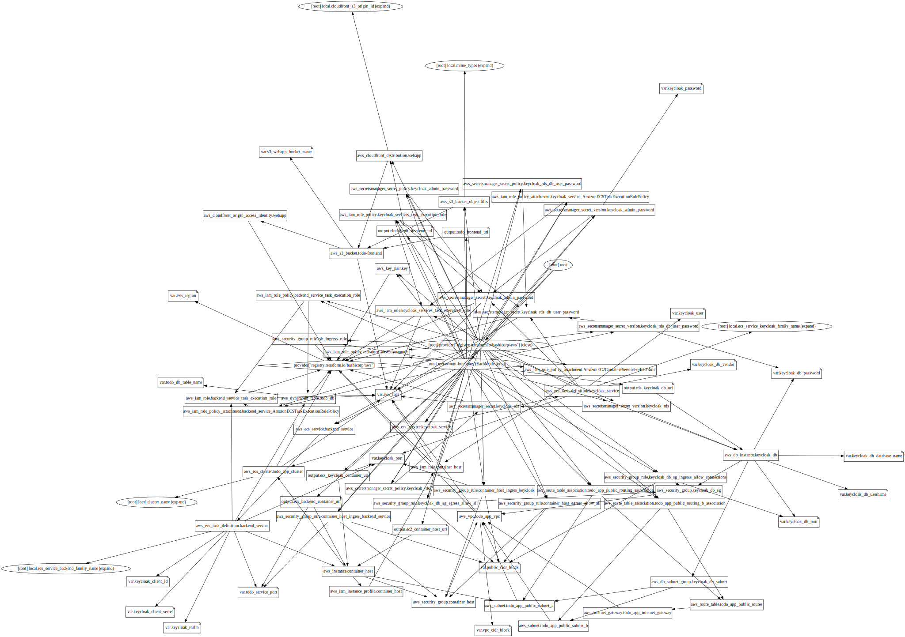

The Terraform State of the AWS Architecture as Graph (other layout):

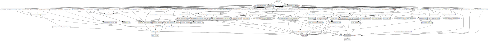

#### Local Architecture

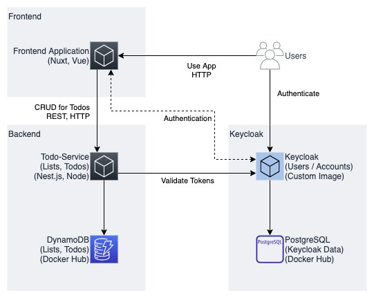

#### Local Services

| Service                 | Description                                                              |
|-------------------------|--------------------------------------------------------------------------|
| Docker & Docker-Compose | Host the application and services                                        |
| PostgreSQL              | The official Postgres Docker Image                                       |
| DynamoDB-Local          | A local, containerized version of DynamoDB which runs completely offline |

#### Technologies

**Backend**:

| Technology            | Description                                                            |
|-----------------------|------------------------------------------------------------------------|
| Node.js 16            | JavaScript Runtime                                                     |
| TypeScript            | JavaScript with Types                                                  |
| Nest.js               | Application Framework for JavaScript/TypeScript to build REST-Services |
| Nest-Keycloak-Connect | Library to easily work with Keycloak                                   |
| AWS SDK               | AWS SDK to programmatically use DynamoDB (CRUD Operations)             |

**Frontend**:

| Technology               | Description                             |
|--------------------------|-----------------------------------------|
| Node.js 16               | JavaScript Runtime                      |
| TypeScript               | JavaScript with Types                   |
| Nuxt.js                  | An application framework for Vue.js     |
| Bootstrap & BootstrapVue | For building responsive User Interfaces |

## Screenshots

#### Application

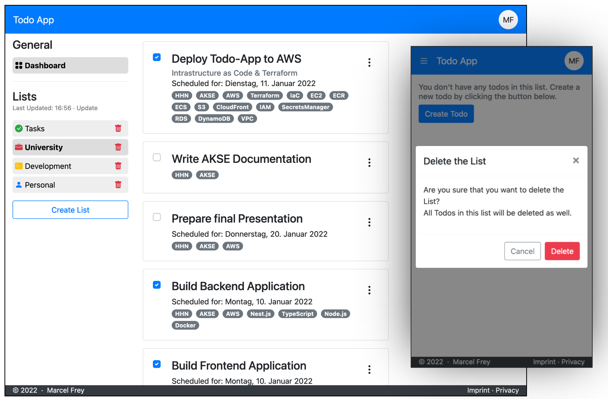

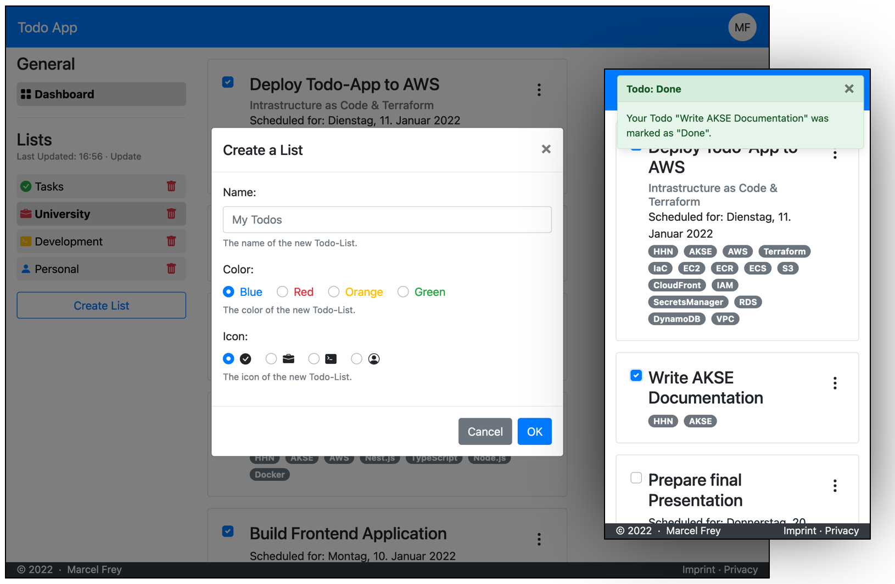

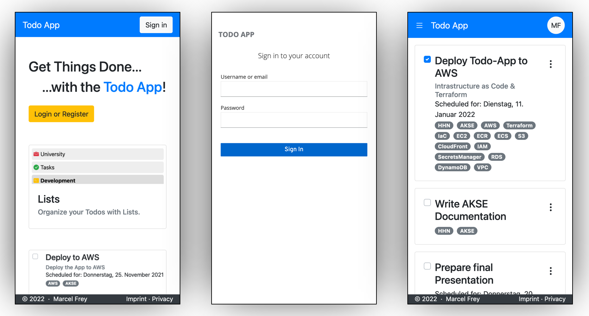

#### CI/CD Pipeline

All stages of the CI/CD Pipeline:

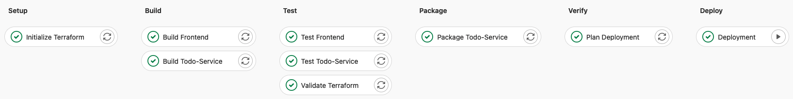

Job Dependencies of the CI/CD Pipeline:

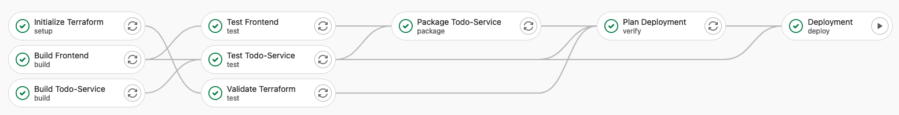

Job Dependencies of the CI/CD Pipeline as graph:

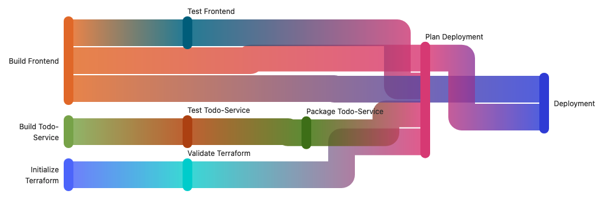

Terraform Report from the CI/CD Pipeline in a Merge Request:

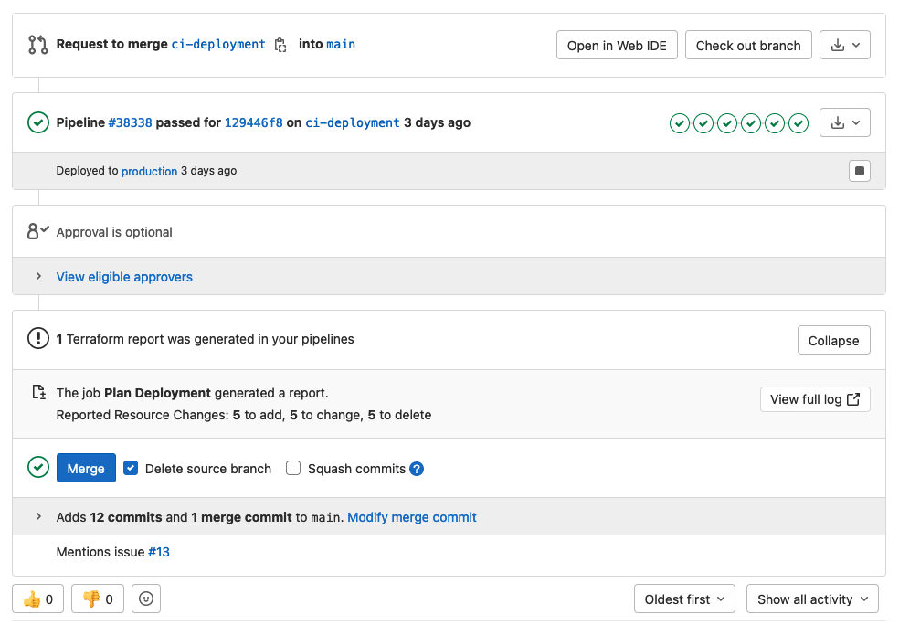

CI/CD in a Merge Request:

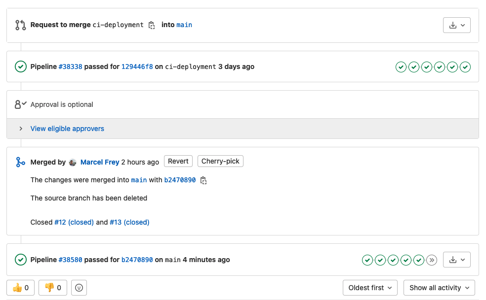

#### CloudWatch Metrics

The AWS Free-Tier usage for January 20221:

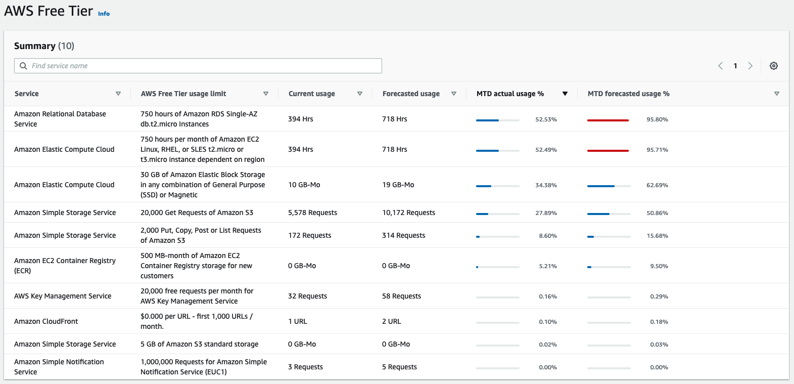

EC2 Metrics:

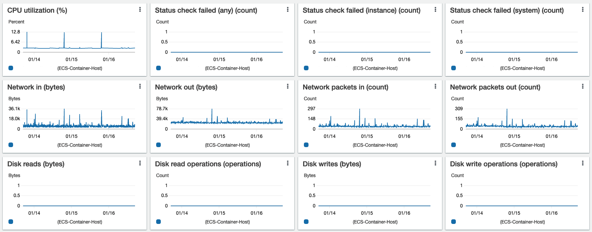

RDS Metrics:

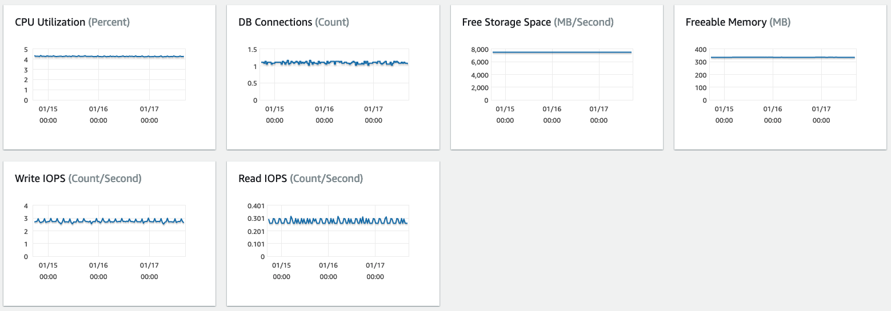

ECS Metrics:

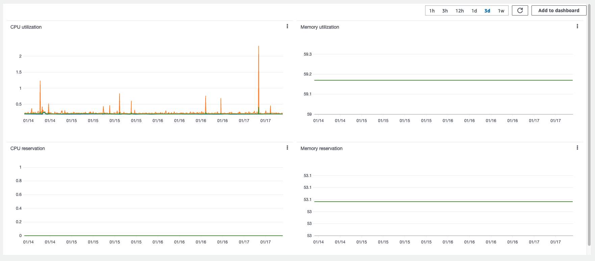

S3 Metrics:

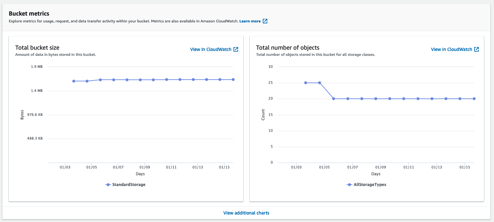

1: 01.01.2022 - 17.01.2022
