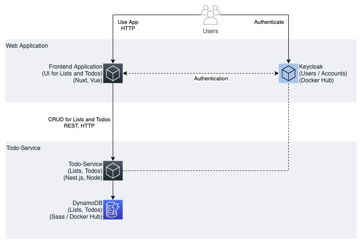
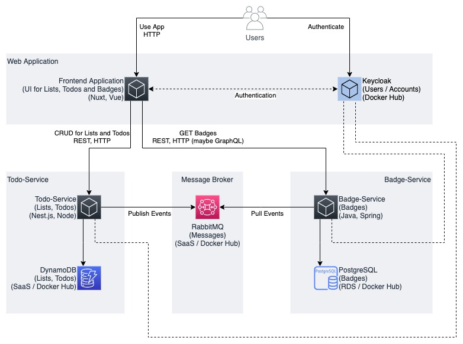
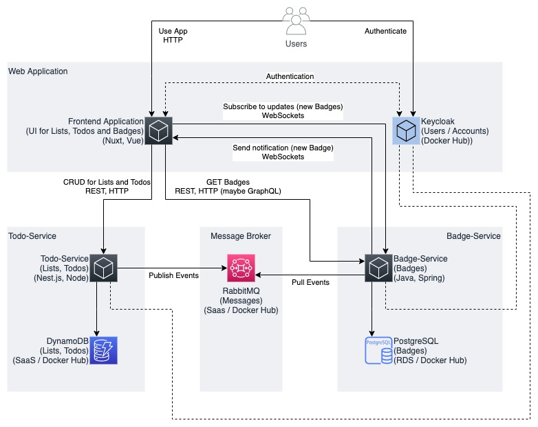

# Idea for the Project

## Application

- **Todo-List App** (Minimal App)
- **Todo-List App with Gamification** (Advanced App)
- **Todo-List App with Gamification & Badge Notifications** (Full App)
- Add Monitoring (Prometheus + Grafana / CloudWatch)
- Add Tracing
- Add Config-Service (or Feature Flags)

## User Stories & Features

- General (Minimal App)
    - As user, I want to register for an account so that I can use the app.
    - As user, I want to sign in into my account so that I can see all my lists, todos and badges.
- Lists (Minimal App)
    - As user, I want to create a list so that I can organize my todos. (List: Create)
    - As user, I want to see all my lists. (List: Read)
    - As user, I want to rename a list. (List: Update)
    - As user, I want to delete a list. (List: Delete)
- Todos (Minimal App)
    - As user, I want to create a todo in a list. (Todo: Create)
    - As user, I want to see all todos in a list. (Todo: Read)
    - As user, I want to edit a todo. (Todo: Update)
    - As user, I want to mark a todo as completed so that is disappears from the list. (Todo: Update)
    - As user, I want to delete a todo. (Todo: Delete)
- Badges (Advanced App)
    - As user, I want to receive badges so that I stay motivated.
    - As user, I want to see all my Badges (Badge: Read)
- Badges (Full App)
    - As user, I want to be notified, if I receive a new badge.
- Badge-Ideas (Advanced App)
    - First List = User created a list
    - Organizer = User has three or more lists
    - Planner = User has 10 or more open Todos in a list
    - All Done = User completed a todo and there are no todos left in the list

## Architecture

**Minimal App**

**Advanced App**

**Full App**

## Services

Service                | Technology         | Local / Development           | AWS
---------------------- | ------------------ | ----------------------------- | ---------
Web App (Static)       | Node, Vue.js, Nuxt | Docker Node (later nginx?) | S3 ---
Keycloak               | ---                | Docker Keycloak            | Cognito or Keycloak --- or EC2 / ECS
Todo-Service           | Node, Nest.js      | Docker ---                 | EC2 / ECS ---
Todo-DB DynamoDB    | ---                | Docker DynamoDB-local      | Dynamo DB ---
RabbitMQ               | ---                | Docker RabbitMQ            | Amazon MQ (RabbitMQ) ---
Badge-Service          | JVM, Spring Boot   | Docker ---                 | EC2 / ECS ---
Badge-DB PostgreSQL | ---                | Docker PostgreSQL          | RDS (PostgreSQL) ---

## Communication

- REST (Minimal App)
    - `CRUD` for Lists
    - `CRUD` for Todos
    - `-R--` for Badges
- Web Sockets (Full App)
    - Subscribe to updates
    - Send a notification to the user, if he has received a new badge
- Messaging
    - Publish events for CRUD-Events of Lists and Todos
    - Process the events (assign badges if a condition matches)
- GraphQL (maybe later)

## Terraform

- Configure RabbitMQ with Terraform **?**
- Configure Keycloak with Terraform **?**
- Possible**?**
    - `docker compose up` alone won't work then
    - `tf apply` is required as well
    - Configure with Terraform AND mount the config

