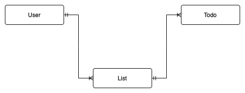

# Todo-DB Data Modeling (NoSQL, DynamoDB)

## Entity-Relationship Diagram

> The **User** Entity is managed by Keycloak. 
> We only need the UserID which can be read from the JWT.

- A **User** can have multiple **Lists**
- A **List** can have multiple **Todo**-Item

## Access Patterns

> The UserID is known from the JWT.  
> We don't need to store Users.

Entity | Access Pattern            | Query
------ | ------------------------- | -----
List   | Fetch all lists of a user | `PK = "USER#<userID>"`
List   | Fetch one list            | `PK = "USER#<userID>"`  `SK = "LIST#<listID>"`
List   | Update an existing list   | `PK = "USER#<userID>"`  `SK = "LIST#<listID>"`
List   | Delete an existing list   | `PK = "USER#<userID>"`  `SK = "LIST#<listID>"`
Todo   | Fetch all todos of a list | `PK = "LIST#<listID>"`
Todo   | Fetch one todo            | `PK = "LIST#<listID"`  `SK = "TODO#<todoID>"`
Todo   | Update an existing todo   | `PK = "LIST#<listID"`  `SK = "TODO#<todoID>"`
Todo   | Delete an existing todo   | `PK = "LIST#<listID"`  `SK = "TODO#<todoID>"`

## Entity Table (Item Types)

> No User, because we don't have to store them in this table.

Entity | Partition Key   | Sort Key        | Attributes
------ | --------------- | --------------- | ----------
List   | `USER#<userID>` | `LIST#<listID>` |  `partitionKey` (UserID) `sortKey` (ListID) `name` `color` `icon`
Todo   | `LIST#<listID>` | `TODO#<todoID>` |  `partitionKey` (ListID) `sortKey` (TodoID) `title` `description` `dueDate` `isFlagged` `tags` `isDone` `owner` (UserID)

## Table Structure (Example)

