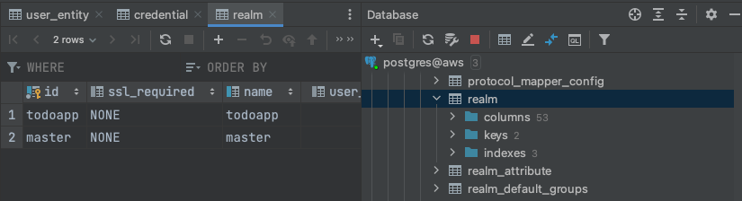
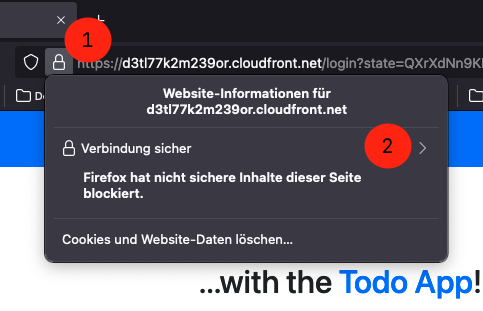
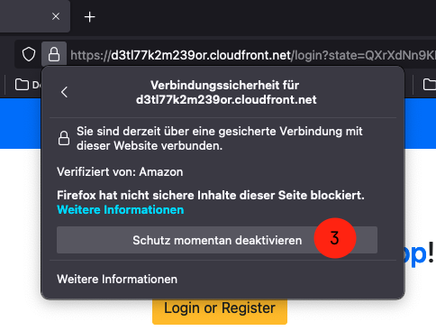
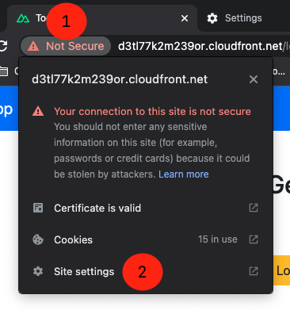
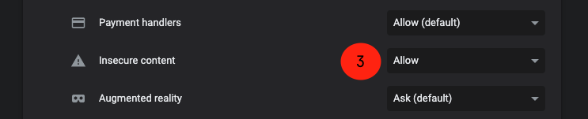

# AWS Setup

This guide describes how to deploy and set up the Todo-Application on AWS.

Prerequisite:

- AWS Account
- Terraform
- Node.js (Version 16)
- Docker

This guide uses the AWS Region `eu-central-1`. If you use a different region, you might have to make additional adjustments.

-----

**If you have problems or need help, please contact me!**

-----


Note: I haven't tried to apply the whole configuration at once. So there might be some conflicts/dependencies that are currently unknown/undocumented. While development, I applied the infrastructure in incremental steps.

# 1. Setup Common Infrastructure

In a _real_ project, these are infrastructure components that are located on organization level. This includes IAM Groups/User/Roles and the Elastic Container Registry.

```shell
# From the project root, navigate to the terraform/workspace/aws-core directory
$ cd terraform/workspace/aws-core

# Initialize Terraform
$ terraform init

# Plan
$ terrafrom plan

# Apply the configuration
$ terrafrom apply
```

# 2. Build the Frontend-Application

The Frontend-Application is deployed by uploading the static assets to an S3 Bucket. Uploading the files is done with Terraform, so we have to build the frontend first.

Terraform will upload the `dist/` directory of the `todo-frontend` project to S3.

```shell
# From the root folder, navigate to the Project Directory
cd todo-frontend/

# Install dependencies
run npm install

# Build the SPA for production
npm run generate:prod
```

## 3. Build the Backend-Service and push it to ECR

The Backend-Service will be deployed as Container. In the ECS Task-Definition we can define an image we want to use. Instead of pulling images from Docker Hub, we use own Elastic Container Registry we created in [Step 1](#1-setup-common-infrastructure). Everything that relates to ECS is deployed with Terraform. Before we can apply the Terraform configuration, we have to build and upload an image of our Backend-Service to ECR.

In the following Code, replace `ACCOUNT_NUMBER` with the Account Number of your AWS Account.

```shell
# From the root folder, navigate to the Backed-Service project
cd todo-service/

# Install dependencies
run npm install

# Build the Backend-Service
npm run build

# Login to ECR with a temporary Login
aws ecr get-login-password --region eu-central-1 | docker login --username AWS --password-stdin ACCOUNT_NUMBER.dkr.ecr.eu-central-1.amazonaws.com

# Build Docker Image (Important: Use the Production Dockerfile!)
docker build -f Production.Dockerfile -t akse-todo-service .

# Tag Image
docker tag akse-todo-service:latest ACCOUNT_NUMBER.dkr.ecr.eu-central-1.amazonaws.com/akse-todo-service:latest

# Push the Image to ECR
docker push ACCOUNT_NUMBER.dkr.ecr.eu-central-1.amazonaws.com/akse-todo-service:latest
```

# 4. Deploy with Terraform

Now it's time to deploy the actual project to AWS.

Before we can plan or apply the Terraform configuration, some variables have to be changed.

- Open the file `terraform/workspaces/aws/variables.tf` and change the `default` value of `s3_webapp_bucket_name`. (Reason: S3 Buckets need a globally unique name)
- Open the file `terraform/workspaces/aws/ecs-tasks/backend-service-container.tftpl` and change the `image` field to the URL of Elastic Container Registry. (Reason: Use your Registry)
    - > Note: This should be a variable and configurable in the `variables.tf` file... #TODO

After changing the values, we can run Terraform. If you plan or apply the Terraform configuration, Terraform will ask for some values.<br>
**On the first run, please note the values you pass to Terraform, because you need them again later**.<br>
Tip: I stored these values in my password manager.

| Variable                 | Description                                          | Note                                                                                                                                           |
|--------------------------|------------------------------------------------------|------------------------------------------------------------------------------------------------------------------------------------------------|
| `keycloak_db_username`   | The admin username for the PostgreSQL Database (RDS) | Choose a value, only use alphanumeric characters, see [details](../07.Learnings-and-Possible-Improvements/LEARNINGS#secrets-on-aws-and-gitlab) |
| `keycloak_db_password`   | The admin password for the PostgreSQL Database (RDS) | Choose a value, only use alphanumeric characters, see [details](../07.Learnings-and-Possible-Improvements/LEARNINGS#secrets-on-aws-and-gitlab) |
| `keycloak_user`          | The username of the Keycloak admin account           | Choose a value, only use alphanumeric characters, see [details](../07.Learnings-and-Possible-Improvements/LEARNINGS#secrets-on-aws-and-gitlab) |
| `keycloak_password`      | The password of the Keycloak admin account           | Choose a value, only use alphanumeric characters, see [details](../07.Learnings-and-Possible-Improvements/LEARNINGS#secrets-on-aws-and-gitlab) |
| `keycloak_client_secret` | The client secret of the Backend-Service in Keycloak | We don't have a value currently, use `DEMO` for now                                                                                            |

```shell
# From the root folder, navigate to terraform/workspaces/aws
cd terraform/workspaces/aws/

# Initialize Terraform
$ terraform init

# Plan
$ terrafrom plan

# Apply the configuration
$ terrafrom apply
```

**There is a bug that the EC2 Instance does not register itself automatically at the ECS Cluster**. This means that ECS can't start containers. To fix this issue, see [next step](#5-reboot-the-ec2-instance)

## 5. Reboot the EC2 Instance

The EC2 Instance is set up with CloudInit. CloudInit installs all required software and configures the ECS Agent.

But, the Instance does not register itself at the ECS Cluster. A manual restart is fixing this problem.

**Before you reboot the Instance, make sure to wait a bit so that CloudInit can finish the setup!** You can check the EC2 Logs to see the progress.

So open the EC2 page in the AWS Management Console and restart the Instance.

## 6. Make sure you can access the Services

Now, you should be able to access the different services. Use the `output` values from Terraform (see Step 4) in combination with the Service-Ports. You can find the Ports for each service in the `terraform/workspaces/aws/variables.tf` file.

- Frontend (CloudFront) - Should show the Single Page Application
- Frontend (S3) - Should show access denied, because only CloudFront is allowed to access the S3 Bucket
- Keycloak (Port: 5902)
- Backend-Service (Port: 5903)

## 7. Disable Keycloak HTTPS

By default, Keycloak enforces HTTPS. Because there is no HTTPS support, we can't access Keycloak - not even to disable the HTTPS enforcement...

We can't use the Web-Frontend nor the API. We have to manipulate the Database directly...

**This is not a good solution, but at the moment there is no other solution.**

To disable HTTPS support, you have to connect to the RDS Instance, for example with the IntelliJ Database Tools. Connect to the Instance by using the Database URL from the AWS Management Console, your defined username (`keycloak_db_username`) and password (`keycloak_db_password`).

- Connect to the Database
- Navigate to the Table `realm` and open it
- Find the entry (row) where the `id` is `master`
- Change the value of `ssl_required` to `NONE` (the default is `EXTERNAL`)
- Make sure that these changes are applied (e.g. in the DB-Tools there is _publish_ button)



## 8. Configure Keycloak with Terraform

After disabling the HTTPS enforcement in Keycloak, we can access the Keycloak UI as well as the API. That's good news because the Keycloak Terraform Provider needs to talk to the API. To configure Keycloak, we use Terraform again.

Before we can plan or apply the Terraform configuration, some variables have to be changed.

Open the file `terraform/workspaces/config/aws.tfvars` and adjust the following variables. For the values use the Terraform Outputs of [Step 4](#4-deploy-with-terraform). You can find an example below the table.

| Variable                     | Description                                                                    |
|------------------------------|--------------------------------------------------------------------------------|
| `keycloak_url`               | The URL where the Keycloak Server is running, including the port               |
| `keycloak_redirect_frontend` | The URL where the Frontend-Application is hosted. The URL has to end with `/*` |
| `keycloak_root_url_frontend` | The URL where the Frontend-Application is hosted                               |

Example:

```terraform
keycloak_url               = "http://ec2-52-59-244-218.eu-central-1.compute.amazonaws.com:5902"
keycloak_redirect_frontend = [
    "https://d3tl77k2m239or.cloudfront.net/*"
]
keycloak_root_url_frontend = "https://d3tl77k2m239or.cloudfront.net"
```

After adjusting the values, you can apply the Terraform Configuration.

```shell
# From the root folder, navigate to terraform/workspaces/aws
cd terraform/workspaces/aws/

# Initialize Terraform
$ terraform init

# Plan
$ terrafrom plan -var-file="aws.tfvars"

# Apply the configuration
$ terrafrom apply -var-file="aws.tfvars"
```

## 9. Re-build the Frontend-Application

The Frontend-Application needs knowledge about Keycloak and the Backend-Service, because...

1. ...it has to redirect the user to Keycloak
2. ...it has to call the Backend-Service

We only got these values by applying the Terraform Configuration. So, we can't set them earlier. Now it's time to set them to the correct value.

Open the `/todo-frontend/production.env` file and change the values from the table. Use the Terraform Outputs as values.

| Variable                         | Description                                                      |
|----------------------------------|------------------------------------------------------------------|
| `NUXT_ENV_KEYCLOAK_HOST`         | The URL where the Keycloak Server is running, including the port |
| `NUXT_ENV_KEYCLOAK_REDIRECT_URI` | The URL where the Frontend-Application is hosted                 |
| `NUXT_ENV_TODO_SERVICE_URL`      | The URL where the Backend-Service is hosted, including the port  |

Example:

```
# Keycloak
NUXT_ENV_KEYCLOAK_HOST=http://ec2-52-59-244-218.eu-central-1.compute.amazonaws.com:5902
NUXT_ENV_KEYCLOAK_REALM=todoapp
NUXT_ENV_KEYCLOAK_REDIRECT_URI=https://d3tl77k2m239or.cloudfront.net/
NUXT_ENV_KEYCLOAK_CLIENT_ID=todofrontend

# Backend Service
NUXT_ENV_TODO_SERVICE_URL=http://ec2-52-59-244-218.eu-central-1.compute.amazonaws.com:5903

```

Now we have to rebuild the Frontend, because for a Single Page Application the environment variables have to be injected at build-time.

```shell
# From the root folder, navigate to the Project Directory
cd todo-frontend/

# Install dependencies
run npm install

# Build the SPA for production
npm run generate:prod
```

Uploading the new files from the `/dist` folder is done in a later step.

## 10. Get the Keycloak Client Secret

The Backend-Service needs to talk to Keycloak, so it needs the URL and the Keycloak Secret.

The URL is automatically set by Terraform, so we don't need to do something here.

The Client Secret is required when we apply Terraform, but in [Step 4](#4-deploy-with-terraform) we haven't had the real value - so we used `DEMO`.

- Open Keycloak (`http://<ec2-address>:<port>/auth/admin/master/console/#/realms/todoapp`) and sign in with the values of `keycloak_user` and `keycloak_password` you noted in [Step 3](#4-deploy-with-terraform)
- In the left navigation bar, choose "Clients"
- Click on the "todoservice" client.
- On the top, select the _Credentials_ Tab.
- Click the "Regenerate Secret" button. **Note this secret because we require it later.**

| Variable                 | Description                                          | Note                            |
|--------------------------|------------------------------------------------------|---------------------------------|
| `keycloak_client_secret` | The client secret of the Backend-Service in Keycloak | Note the value you "Regenerate" |

## 11. Deploy with Terraform (again)

Now we have updated all files with the URLs of our server. Plus, we know all values we have to pass to Terraform.

Let's apply our updates Terraform Configuration! If you plan or apply the Terraform configuration, Terraform will ask for some values.<br>

| Variable                 | Description                                          | Note                             |
|--------------------------|------------------------------------------------------|----------------------------------|
| `keycloak_db_username`   | The admin username for the PostgreSQL Database (RDS) | Use the value you noted earlier! |
| `keycloak_db_password`   | The admin password for the PostgreSQL Database (RDS) | Use the value you noted earlier! |
| `keycloak_user`          | The username of the Keycloak admin account           | Use the value you noted earlier! |
| `keycloak_password`      | The password of the Keycloak admin account           | Use the value you noted earlier! |
| `keycloak_client_secret` | The client secret of the Backend-Service in Keycloak | Use the value you noted earlier! |

```shell
# From the root folder, navigate to terraform/workspaces/aws
cd terraform/workspaces/aws/

# Initialize Terraform
$ terraform init

# Plan
$ terrafrom plan

# Apply the configuration
$ terrafrom apply
```

## 12. Enable User Registration

By default, "User Registration" is disabled for the Todo-Realm in Keycloak. Before we can use the application, we have to enable it.

- Open Keycloak (`http://<ec2-address>:<port>/auth/admin/master/console/#/realms/todoapp`) and sign in with the values of `keycloak_user` and `keycloak_password` you noted in [Step 3](#4-deploy-with-terraform)
- On the top, select the _Login_ tab
- Make sure the Switch "User registration" is enabled (`On`)
- Click the "Save" button at the bottom

**WARNING: If this option is enabled, everyone can register for an account!** I recommend disabling this option again once you registered for an account.

**Note**:<br>
It is also possible to enable user registration via Terraform. In the `/terraform/workspaces/config/keycloak-realms.tf` file, just set the value for `registration_allowed` to `true` and apply the configuration.

## 13. Open App and sign in

The application is now fully setup and ready to use.<br>
Congratulations! 🥳

**But, there are still some important infos - so continue with the next step.**

- Open your Cloudfront URL (from the Terraform Outputs) and click the "Sign in" Button in the upper right
- On the first time, you have to register for a new account (you can't use the admin account because it is not in the Todo-Realm)
    - Click on "Register" and follow the registration process
- After the registration you are redirected to the "Marketing Page" - Continue with [Step 14](#14-disable-mixed-content) to fix this issue.

## 14. Disable Mixed-Content

After a "Sign in" or "Register" you should be redirected to the Application. Instead, you just see the "Marketing Page" again.

The reason for this behaviour is that browsers are blocking Mixed-Content - the combination of HTTPS and HTTP. (See [Mixed Content](../07.Learnings-and-Possible-Improvements/LEARNINGS.md#http--https---mixed-content))

Firefox and Chrome (both on Desktop) allow us to temporarily disable this protection. Safari does not allow to disable that option. So Safari on macOS, iOS and iPadOS don't work and can't use our Todo-Application.

#### Disable in Firefox

1. Click on the Lock next to the address bar
2. Click the "Connection secure" button
3. Click "Temporarily disable protection"

Then, click on the "Sign in" button again. Now, everything should work fine.

 

#### Disable in Chrome

1. Click on the Warning next to the address bar
2. Click on "Site settings"
3. Search for the permission "Insecure content" and set the value to `allow`

Then, click on the "Sign in" button again. Now, everything should work fine.

 

## 15. Use the App

Now you should be able to use the Todo-Application!<br>
Congratulations! 🥳
