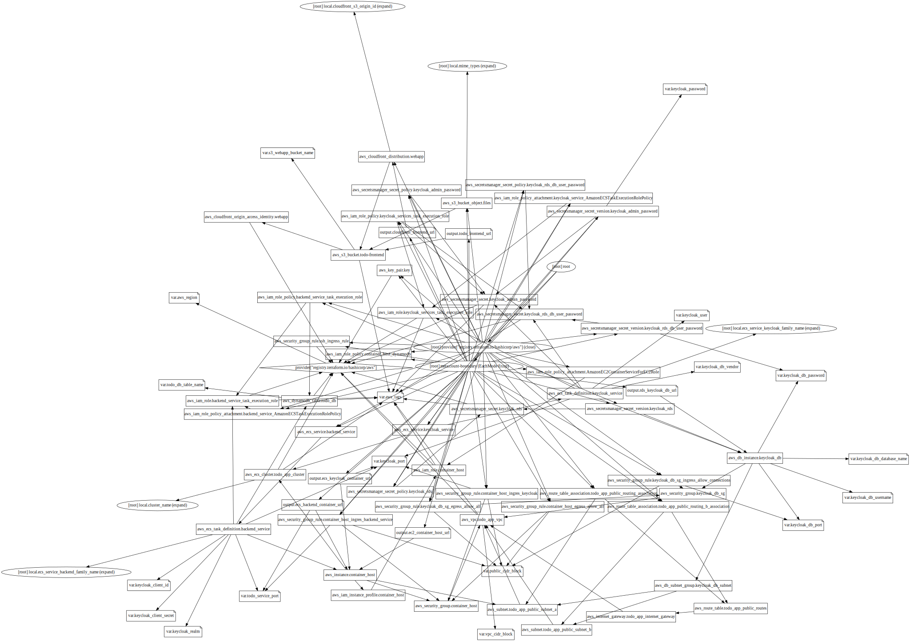
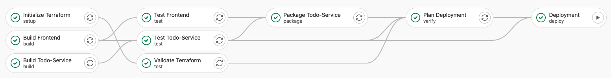

# Final Presentation

**Selected Topics in Software Engineering** (Cloud Computing 1) 
**Marcel Frey**

## Project Paris - Todo Application

## Results

- [x] **Single Page Application Frontend** built with Nuxt.js, Vue.js, Bootstrap and TypeScript
- [x] **Containerized Backend-Service** built with Nest.js and TypeScript
- [x] **Keycloak** used for authentication and authorization
- [x] Runs entirely local with **Docker** and **Docker-Compose**
- [x] Runs entirely in the cloud on **Amazon Web Services (AWS)**: S3, CloudFront, VPC, EC2, ECS, ECR, RDS, DynamoDB, IAM, Secrets Manager
- [x] The AWS Infrastructure is **100%** declared with **Terraform**
- [x] The Application can be continuously deployed via a **CI/CD Pipeline**
- [x] **Documentation** for building and running the App yourself
- [x] Documented learnings, problems, challenges, improvements and alternative solutions

## Intermediate Presentation

**Intermediate presentation:**

- Running Application (locally) - Frontend, Backend, Keycloak
- Basic App functionality (CRUD-Operations for Todo-Items)

**New since the intermediate presentation:**

- The Backend-Service is now running in Docker (Fixed the `wrong ISS` error) - Completed fully local version
- Todo-Lists can now be deleted (added `DELETE` endpoint and functionality)
    - All Todos in the list are deleted as well
- Refactorings: Change the way I work with environment variables
    - Before they have been `.env` files in every project and in the `docker-compose.yml` file
    - Now, all environment variables have to be passed to the container
    - The frontend still has its own `.env` files, because they need to be injected on build-time for production.
- Various bug fixes and improvements for Frontend and Backend
- Deploy to AWS via Terraform
- CI/CD Pipeline

## AWS Architecture and Services

| AWS Service                          | Description                                                                                                                       |
|--------------------------------------|-----------------------------------------------------------------------------------------------------------------------------------|
| Simple Storage Service (S3)          | Host the static assets                                                                                                            |
| CloudFront                           | Distribute the static website                                                                                                     |
| Virtual Private Cloud (VPC)          | Networking for EC2 and RDS                                                                                                        |
| Elastic Compute Cloud (EC2)          | An EC2 Instance which is used as Container Host for the Elastic Container Service                                                 |
| Elastic Container Service (ECS)      | Run and manage containers                                                                                                         |
| Elastic Container Registry (ECR)     | A fully managed container registry where the Docker Images of the Backend-Service are stored                                      |
| Relational Database Service (RDS)    | A fully maned PostgreSQL Database which is used by Keycloak                                                                       |
| DynamoDB                             | Fully managed NoSQL Database where the Backend-Service stored Todo-Lists and Todos                                                |
| Secrets Manager                      | Securely store passwords and secrets. ECS takes Secret-ARNs as environment variables so that secrets are not stored in plain text |
| Identity and Access Management (IAM) | For User-Groups, Users, Roles and Policies                                                                                        |

## 100% Infrastructure as Code - Terraform

Split Terraform Code into three projects:

- AWS Core (`/aws-core`) - for infrastructure that not directly belongs to the project (_organization level_)
- AWS (`/aws`) - the actual project infrastructure
- Config (`/config`) - for configuring services

The Terraform State of the main AWS Architecture as Graph (`/aws` project):

## CI/CD Pipeline

Job Dependencies of the CI/CD Pipeline:

Terraform Report from the CI/CD Pipeline in a Merge Request:

## Learnings and possible Improvements

#### S3 Static Website Hosting - MIME-Types and Terraform

- After deploying the static website with Terraform (uploading static assets to S3), the website didn't show up - the browser wants to download the `index.html` file
- Reason: Wrong MIME-Type (Example `binary/ocet-stream` instead of `text/html` for the file `index.html`)
- Solution: Explicitly tell Terraform to set the MIME-Type

#### CloudFront and Single Page Applications

- Nuxt.js only allowed the redirect to Keycloak in a secure context (on HTTPS)
- Problem: S3 Website is only reachable with HTTP
- Solution: Add CloudFront which comes with a default HTTPS certificate
    
- Problem: Redirect from Keycloak back to the Frontend don't work, because CloudFront can't find the file
- The URL we open does not exist "on the file system", it only exists "virtual" and is handled by the SPA
- Solution: Define a custom error handler in CloudFront
    - For every error, CloudFront returns the `index.html` file with the HTTP Code `200`
    - The URL stays unchanged and can be handled by the SPA
    - All error handling has to be done by the SPA

#### ECS Port Mappings: Deployments and Scaling

- Container Ports are mapped to the EC2 Instance
    
- Problem: We can't scale because _the port is already in use_
- Solution: Add a Load Balancer

- Problem: Zero-downtime-deployments fail for the same reason
- Solution: Disable zero-downtime-deployments

#### Loosely Coupled Infrastructure

- Three Terraform projects - The main AWS projects depends on the AWS-Core project
- We can't deploy our Infrastructure at once, multiple steps and deployments are required
    - Example: Static Website needs to be rebuilt after we know the Backend-Address
        
- Problem: Currently, the Frontend-Application talks directly to the Backend-Service. If we move the Backend-Service to an AWS Lambda function, we have to update the Frontend-Application too because the address changes.
- Solution: Use an API Gateway. If the Frontend-Application only relies on an API Gateway, we can update the Backend-Service independent of the Frontend-Application.

## Documentation

- [Idea for the Project and Requirements](../01.Idea/README.md)
- [DynamoDB Table Modelling](../02.DynamoDB-Modelling/README.md)
- [Frontend-Application](../../todo-frontend/README.md)
- [Backend-Service](../../todo-service/README.md)
- [Keycloak](../../keycloak/README.md)
- [Infrastructure as Code - Terraform](../../terraform/README.md)
- [Setup: Local Setup](../03.Local-Setup/README.md)
    - How to run the App locally?
    - Step-by-Step guide
    - Setup-Script for interactive setup
- [Setup: AWS Setup](../04.AWS-Setup/README.md)
    - How to deploy the App to AWS?
    - Step-by-Step guide
- [Intermediate Presentation](../05.Intermediate-Presentation/README.md)
- Final Presentation (This README.md file)
- [Learnings](../07.Learnings-and-Possible-Improvements/LEARNINGS.md)
    - All learnings, problems and solutions
- [Possible Improvements](../07.Learnings-and-Possible-Improvements/IMPROVEMENTS.md)
    - Alternative solutions
- Code Comments, sometimes with background infos, problems I had, and solutions for these problems
