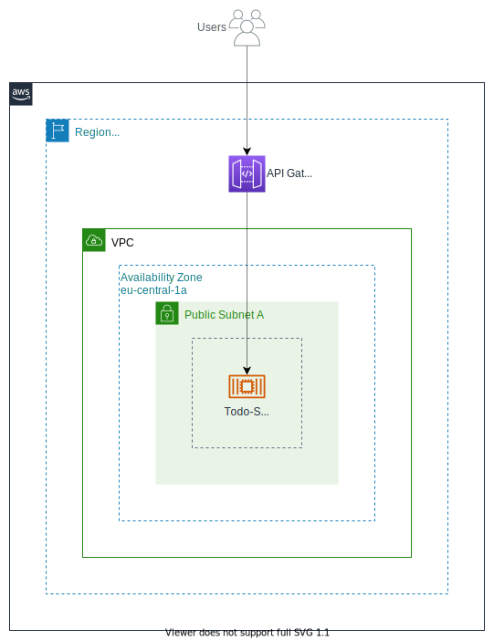

# Improvements

This file describes possible improvements for the Todo-Application.

## Load-Balancing for ECS Containers

Currently, the ECS containers are mapping their ports to the underlying EC2 instance. This causes several [problems](LEARNINGS.md#ecs-port-mappings-deployments-and-scaling) like no option to scale and no zero-downtime-deployments.

To fix this issue we can add a Load Balancer in front of the containers. All incoming traffic goes the Load Balancer. The Load Balancer then forwards the traffic to the containers.

This would enable zero-downtime-deployments because the containers can use different ports. In addition, we have the ability to scale the containers. This also fixes the problem with the [deployments](LEARNINGS.md#ecs-port-mappings-deployments-and-scaling).


-----

## API Gateway for the Backend-Service

Currently, the Frontend-Application talks directly to the Backend-Service.

To improve the architecture, we could add an API Gateway in between. This would further decouple the services.

Currently, the Frontend-Application uses the EC2-DNS-Address. If we move the Backend-Service to an AWS Lambda function, we have to update the Frontend-Application too because the address changes. If the Frontend-Application only relies on an API Gateway, we can update the Backend-Service independent of the Frontend-Application.



-----

## Auto Scaling Group and Launch Template instead of one EC2 Instance

Currently, there is only a single EC2 Instance as Container Host for ECS Containers. This Instance is set up and configured on the initial startup with CloudInit. With this setup we can of course launch new Instances manually or with Terraform and ECS would have more capacity.

The better solution is to use an EC2 Auto Scaling Group because it allows us to scale up and down the Container Host capacity on demand. In this scenario, we define an Auto Scaling group and use it as a Capacity Provider for ECS. ECS can then request more or less capacity. The Auto Scaling Group launches new EC2 Instances based on the requested capacity. If a new Instance is required, an Instance is launches based on a Launch Template which acts as a blueprint of the EC2 Instance.

The Terraform Resources `aws_launch_template` and `aws_instance` have most of the options in common, because the `aws_launch_template` is the blueprint of an `aws_instance` that is launches by the Auto Scaling Group (`aws_autoscaling_group`).


-----

## HTTPS Everywhere

The application should only use HTTPS. So, Keycloak and the Backend-Service need HTTPS support. This also fixes the [Mixed-Content-Problem](LEARNINGS.md#http--https---mixed-content).

-----

## Loosely Coupled Infrastructure as Code

The application should be completely set up with just one command.

Currently, there are three different Terraform projects. In addition, some variables can only be filled if the Terraform configuration was applied once. Then we can take these values, add them to the variables, and then apply the same Terraform configuration again.

The goal should be that the _entire_ application can be launched with one `terrafrom apply` command.

-----

## Even more fine-graded IAM Permissions

It is best practice following the least-privilege principle. Especially the Automation-Bot Group should have even more restrictive permissions.

Currently, the bot has full permissions for all required AWS Services:

```json
{
    "Sid": "AWSServicesAllowedPermissions",
    "Action": [
        "cloudfront:*",
        "dynamodb:*",
        "ec2:*",
        "ecr:*",
        "ecs:*",
        "s3:*",
        "rds:*",
        "secretsmanager:*"
    ],
    "Effect": "Allow",
    "Resource": "*"
}
```

The `*` should be replaced by the action names that are required for the deployment. See [AWS Service Authorization Documentation](https://docs.aws.amazon.com/service-authorization/latest/reference/reference_policies_actions-resources-contextkeys.html). 
